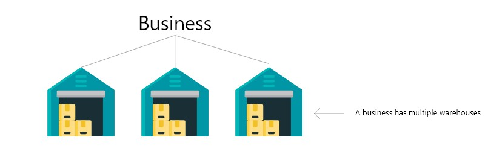
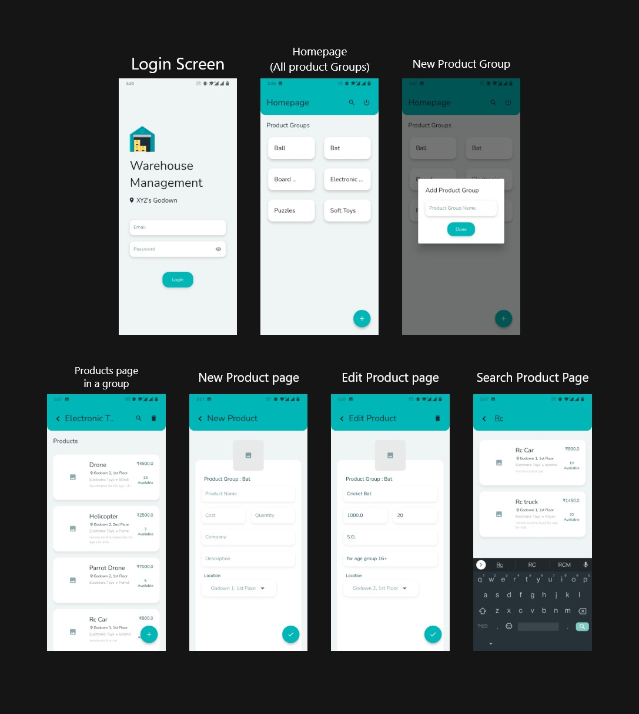

# Warehouse Management 🏬

An application to manage the inventory in multiple warehouses of a business. The products will be stored in groups and user can create any number of groups. In a particular group any number of products can be added along with the whole information of the product.

Suppose there is big business of toys. A lot of wholesale and retail Sales takes place in a day and the business has multiple warehouses and each warehouse has multiple Floors in it.



The business would require an App (can be used by multiple people at a time) that would:
- Help to keep track of all the stocks in all the warehouses of all products.
- Help to quicky locate where the stock of a specific product lies in the warehouses.
- Help to get the price of a specific product (helps in a situation when a customer wants to know the price of the product from manager/salesperson)
- Help to get all available variety of a particular product (For ex: If salesperson want all available types of a “bat” he might get result: [“Plastic bat small”, “Leather bat”, etc])


<br>

## User Experience

<br>



## Development

*Prerequisites:
- Setup [Flutter](https://docs.flutter.dev/get-started/install) environment
- Setup [Firebase](https://firebase.flutter.dev/docs/overview/) App & download `google-services.json` file to `android/app`


### Run
- Clone the repository & Change directory
```sh
git clone https://github.com/HeveshL/warehouse_management.git
cd warehouse_management
```
- Flutter pub get & run
```sh
flutter pub get
flutter run
```

## Downloads

User Interface (Adobe XD) : [Download](https://github.com/HeveshL/warehouse_management/blob/master/doc_assets/Warehouse_Management_Ui.xd)

## License

Distributed under the MIT License. See `LICENSE` for more information.


## Authors

- Hevesh Lakhwani : [@HeveshL](https://www.github.com/HeveshL) - hevesh000@gmail.com


## Contributing

Contributions are always welcome! Your feedback will help me grow as a developer and help me build better and more usable apps.